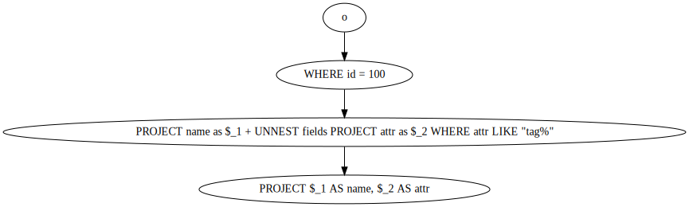

# Sneller CLI Tool

The `sneller` CLI tool wraps the PartiQL parser,
query planner, and execution engine in a CLI tool
to make testing and experimentation easier.

## Usage

The `sneller` reads queries from command-line
arguments or files and executes them, writing
the results to stdout (or to a file specified
with the `-o` flag.)

The PartiQL query "environment" is pre-populated
with the variable `stdin` bound to data arriving
on stdin. Additionally, any literal quoted strings
occuring as table expressions (like `FROM "foo"`)
will be interpreted as file paths.

To evaluate queries from files rather than
from command-line arguments, use the `-f`
flag, which will cause each argument to be
interpreted as a file from which to read a
single query.

## Examples

### Dump Output as JSON

By default, the `sneller` tool will write
the query output (in ion format) directly.

If you pass `-j` to the tool, the output
will be translated to JSON on-the-fly.

(Note: JSON translation is expensive.
If your query outputs a lot of data,
this will be pretty slow.)

```bash
$ sneller -j "select count(*) from 'sampledata.ion.zst'"

# output:
$ {"count": 1023}
```

### Show Query Plan as an SVG Graphic

If you want to see how a query is being
decomposed into its constituent steps,
you can pass the `-g` flag to have the tool
print the query plan in a format that can
be converted to vector graphics using
the [dot(1)](https://graphviz.org/) tool.

Here's an example of a query that uses
a complex predicate with an implicit
cross-join on an array field:

```bash
cat > query.partiql <<EOF
        select o.name, i.attr
        from stdin as o, o.fields as i
        where o.id = 100 and i.attr like "tag%"
EOF
sneller -g -f query.partiql | dot -Tsvg -o plan.svg
```

And here's what ends up in plan.svg:



Note how the `o.id = 100` predicate has been
"pushed down" into a filter operation that occurs
before we perform any unnesting.
