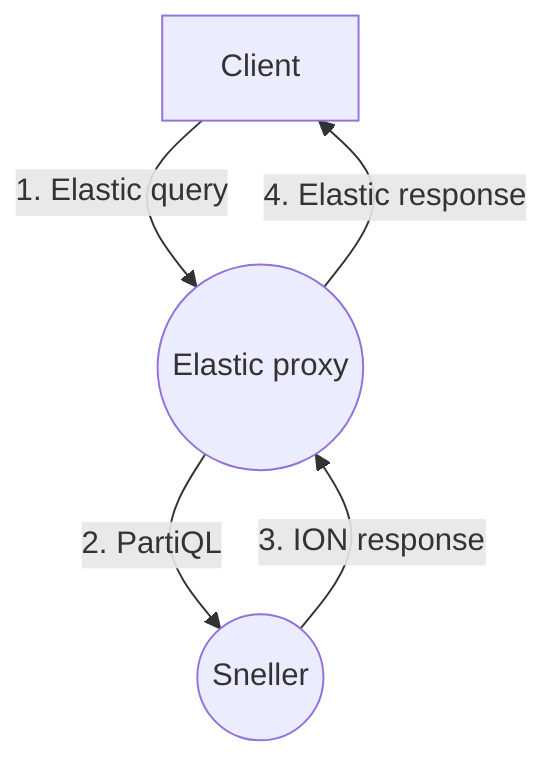
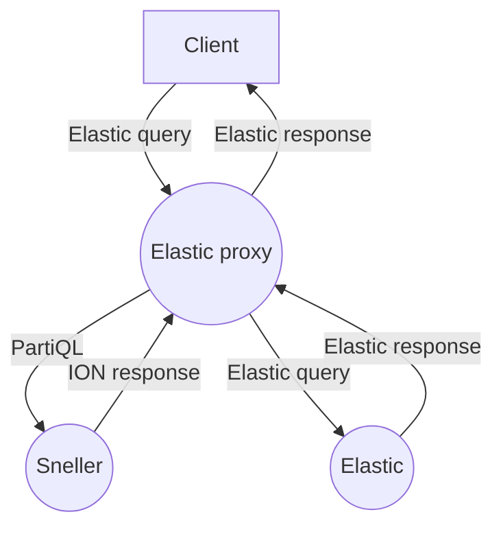

# Introduction
The Elastic proxy adds a compatibility layer on top of the Sneller query engine.
This allows for an easier migration path to Sneller.

Elastic is great, but it can become expensive to handle large amounts of data.
It requires a lot of resources, but also the operational costs may become an
issue. Sneller Cloud is fully serverless and doesn't require any maintenance.
It's also easier to manage large data volumes in a self-hosted environment,
because Sneller stores the data in object storage and not in the computing
nodes. Object storage is cheap. With our cloud offering, you only pay for the
data that is scanned. This also allows for much larger retention periods
without high costs.

# Architecture
The Elastic proxy translates Elastic queries into Sneller compatible SQL queries
and executes the query using the standard Sneller engine. The engine returns
the results in binary ION format and the Elastic proxy translates this back
into an Elastic compatible format.



Each Elastic query is translated to a *single* SQL query that may return
multiple result-sets in a single roundtrip. This ensures that the entire query
is ran on an atomic data-set.

The Elastic Proxy implements the Search and Count API endpoints. All other
endpoints are not supported and return `404` (not found).

It is possible to add a *backing Elastic* that handles all other endpoints. This
can be used in more complex scenarios, where the existing Elastic will still be
used, but only some indexes are directed to Sneller. This can be very useful to
move large indexes out of Elastic (and reduce costs and operational overhead),
while still keeping smaller indexes (that may require updating) in Elastic.



# Configuration
The Elastic proxy is using a single configuration file that is stored in
`s3://<sneller-bucket>/db/elastic-proxy.json` and contains the following fields:

- `logPath` contains the S3 prefix where to write the Elastic proxy logging to
  (i.e. `s3://sneller-bucket/log/elastic-proxy/`). The Elastic proxy will dump
  all requests every minute. Note that there are multiple nodes handling Elastic
  queries, so you may receive multiple objects per minute. The logging key adds
  `<yyyy>/<mm>/<dd>/<hh><mm><ss>-xxxxxxxxxx.ndjson.zst` to the configured
  prefix.

- `logFlags` defines the structure that determines what is being logged and may
  contain:

    - `logRequest` logs the actual Elastic query (optional, defaults to `true`).

    - `logQueryParameters` logs the query parameters that were passed in the URL
       (optional, defaults to `true`).

    - `logSQL` logs the generated PartiQL query that is actually being sent to
       Sneller (optional, defaults to `false`). This can also be used to help
       migrating from Elastic to Sneller, because the generated query may be
       used as a starting point for your own queries.

    - `logSnellerResult` logs the result that is being returned by the Sneller
       engine (optional, defaults to `false`).

    - `logPreprocessed` logs the result after pre-processing the Sneller data
       (optional, defaults to `false`).

    - `logResult` logs the actual Elastic query result (optional, defaults to
      `true`). Note that the Elastic proxy doesn't redact any values, so
      enabling logging may expose sensitive data in your logging and should be
      used with caution. Enabling `logSQL`, `logSnellerResult` or
      `logPreprocessed` is generally not useful. They are only added to diagnose
      issues with the Elastic proxy that are related to query/result
      translation.

- `mapping` contains the mapping between the Elastic index and the Sneller
  table. Each index that should be handled by Sneller must be defined in this
  mapping and has the following fields:

    - `database` is the name of the Sneller database that holds the table
      (required).

    - `table` is the name of the Sneller table that holds the actual data
      (required).

    - `ignoreTotalHits` doesn't include the `hits.total` value. This value is
      often not used and query generation may be more efficient when this value
      doesn't need to be calculated (optional, defaults to `false`). Enabling
      this optimization implicitly sets `ignoreSumOtherDocCount`.

    - `ignoreSumOtherDocCount` doesn't include the `sum_other_doc_count` value
      in some bucket aggregations. This may result in more efficient query
      generation, so you may want to enable this option if you don't use it
      (optional, defaults to `false`).

    - `typeMapping` allows to annotate certain fields to allow proper PartiQL
      query translation. This may be needed for mapping integers to timestamps
      or to indicate that some fields should be treated as lists. More on this
      in the [type mapping](#type-mapping) section.

## Type mapping
Sneller is schema-less, so it sometimes needs some help translating Elastic
queries properly. The Elastic query may use an integer value for a timestamp and
without an explicit mapping it will perform a numerical comparison instead of a
timestamp comparison. To help the Elastic proxy, we use type mappings to
indicate the type/format of a particular field.

The mapping looks like this:
```json
{
    "timestamp": "unix_nano_seconds",
    "*.tags": "list",
    "message": {
        "type": "contains",
        "fields": {
            "raw": "text"
        }
    }
}
```
The `timestamp`, and `*.tags` mappings specify only the type and uses the
*compact* definition. The value is just the type. The `message` field uses the
*extended* definition that also allows to specify the fields.

Note that a field can contain wildcards to match a field. If there is an exact
match, then this will be used. Otherwise a wildcard will be used. If multiple
wildcards match, then the most specific wildcard will be used.

## Timestamps
All fields that should be treated as a timestamp should be included in the type
mapping and specify one of the following types:

 - `datetime` indicates that the field should be treated as a date/time
   (timestamp) value. Queries should use either the RFC3339 or RFC3339 (nano)
   syntax.
 - `unix_seconds`, `unix_milli_seconds`, `unix_micro_seconds` or
   `unix_nano_seconds` indicates that the field should be treated as a date/time
   (timestamp) value. Queries should us a numerical or text value that denotes
   the timestamp in seconds (or one of the other units) since epoch (January
   1st, 1970).

## Text searching
Elastic is known for its extensive text-search features (including fuzzy
searching). Sneller only supports a subset of the functionality. When searching
ordinary text, Sneller can be configured to:

 - `keyword` requires a full and exact match on the entire text.
 - `keyword-ignore-case` requires a full and case-insensitive match.
 - `text` requires a case-insensitive match on a word within the text.
 - `contains` requires a case-insensitive match on a part of the text.

**IMPORTANT**: At this time, this setting is only used for query strings.

Elastic also supports
[fields](https://www.elastic.co/guide/en/elasticsearch/reference/current/multi-fields.html)
that allows multiple methods of searching text. The Elastic proxy also supports
this functionality using the `fields` keyword. You can define custom fields to
allow searching for exact matches (`keyword`) and just an occurrence of the
specified search string (`contains`).

## Lists
Lists require the type to be set to `list` to enable proper query generation
that can search within lists.

## Example
The following configuration will create the `example-ip-logging` index that maps
to the `ip-logging` table in the `networking` database. It logs all the Elastic
requests, query parameters and results. On top of that it also logs the SQL
query that is being generated.

```json
{
    "logPath": "s3://sneller-cache/log/elastic-proxy/",
    "logFlags": {
        "logRequest": true,
        "logQueryParameters": true,
        "logSQL": true,
        "logResult": true
    },
    "mapping": {
        "example-ip-logging": {
            "database": "networking",
            "table": "ip-logging",
            "ignoreTotalHits": true,
            "typeMapping": {
                "timestamp": "unix_nano_seconds",
                "src.tags": "list",
                "dst.tags": "list",
                "message": {
                    "type": "contains",
                    "fields": {
                        "raw": "text"
                    }
                }
            }
        }
    }
}
```
The client doesn't use the `hits.total` field in the Elastic result, so this
optimization is enabled by setting the `ignoreTotalHits` field.

Although Sneller stored the `timestamp` value using a native timestamp format,
the actual Elastic query and result expect an integer value that represents the
time in nanoseconds since Epoch.

Both the `src.tags` and `dst.tags` fields are lists and are annotated. This
allows Elastic queries to actually search within the list.

The `message` field contains text and it uses the extended configuration format,
where both `type` and `fields` are specified. The `type` is set to `contains`
that translates text queries to match a part of the text (instead of exact
matches) when using query strings. It also defines the `raw`
[field](https://www.elastic.co/guide/en/elasticsearch/reference/current/multi-fields.html)
that should be treated as normal text.
<!---
# Endpoints
The Elastic proxy is available in all AWS regions that also support the Sneller
engine. There is both a *staging* and a *production* release that use the
following end-points:

 * `https://elasticproxy-production.<region>.sneller.io` for the production
   version.
 * `https://elasticproxy-staging.<region>.sneller.io` for the staging version.

The staging version often contains the next version that will be deployed to
production. We encourage customers to use the staging release for testing and
notify Sneller if you notice any issues.

The latest version can be checked via a `GET /sneller/version` request, so the
check the latest production version in `us-east-1`, you can get
[`https://elasticproxy-production.us-east-1.sneller.io/sneller/version`](https://elasticproxy-production.us-east-1.sneller.io/sneller/version).

# Authentication
Elastic uses basic authentication that requires both a username and a password.
The username is always `elastic` and the password should be the Sneller token
that can also be used to invoke Sneller queries directly.
--->
# Supported features

## Text search
The Sneller query engine supports all standard SQL text search methods and also
includes (limited) support for fuzzy matching. At this point, the Elastic proxy
only supports partial, word or exact (either case sensitive or case insensitive)
matches. Fuzzy search results are not yet supported.

## Date/time formats and timezone
The Elastic proxy currently only supports the UTC timezone. Specifying other
timezones is not flagged as an error, but is ignored.

## Query string (Lucene syntax)
The Elastic proxy fully supports the [Lucene query
syntax](https://www.elastic.co/guide/en/kibana/current/lucene-query.html). Note
that Sneller currently doesn't support fuzzy text matching and will only return
exact matches.

## Scripting and runtime fields
The Elastic proxy doesn't support
[scripting](https://www.elastic.co/guide/en/elasticsearch/reference/master/modules-scripting.html).
This also prevents the use of runtime mappings in queries.

## Aggregations
Elastic supports a lot of different kind of aggregations. The Elastic proxy
supports most common aggregations. Aggregations are currently added only when
customers make use of them. Note that not all aggregations are possible in
Sneller due to limitations (i.e. scoring, scripting, ...). Please contact
Sneller support if you need an aggregation that is currently not supported.

### Bucket aggregations
|Name|Supported|Remarks|
|----|---------|-------|
|[Adjacency matrix](https://www.elastic.co/guide/en/elasticsearch/reference/current/search-aggregations-bucket-adjacency-matrix-aggregation.html)|:x:||
|[Auto-interval date histogram](https://www.elastic.co/guide/en/elasticsearch/reference/current/search-aggregations-bucket-autodatehistogram-aggregation.html)|:x:||
|[Categorize text](https://www.elastic.co/guide/en/elasticsearch/reference/current/search-aggregations-bucket-categorize-text-aggregation.html)|:x:||
|[Children](https://www.elastic.co/guide/en/elasticsearch/reference/current/search-aggregations-bucket-children-aggregation.html)|:x:||
|[Composite](https://www.elastic.co/guide/en/elasticsearch/reference/current/search-aggregations-bucket-composite-aggregation.html)|:x:||
|[Date histogram](https://www.elastic.co/guide/en/elasticsearch/reference/current/search-aggregations-bucket-datehistogram-aggregation.html)|:white_check_mark:|Week always starts on Sunday.<br>When no documents match a certain date, then the date is omitted from the results.|
|[Date range](https://www.elastic.co/guide/en/elasticsearch/reference/current/search-aggregations-bucket-daterange-aggregation.html)|:x:||
|[Diversified sampler](https://www.elastic.co/guide/en/elasticsearch/reference/current/search-aggregations-bucket-diversified-sampler-aggregation.html)|:x:||
|[Filter](https://www.elastic.co/guide/en/elasticsearch/reference/current/search-aggregations-bucket-filter-aggregation.html)|:white_check_mark:||
|[Filters](https://www.elastic.co/guide/en/elasticsearch/reference/current/search-aggregations-bucket-filters-aggregation.html)|:white_check_mark:||
|[Frequent items](https://www.elastic.co/guide/en/elasticsearch/reference/current/search-aggregations-bucket-frequent-items-aggregation.html)|:x:||
|[Geo-distance](https://www.elastic.co/guide/en/elasticsearch/reference/current/search-aggregations-bucket-geodistance-aggregation.html)|:x:||
|[Geohash grid](https://www.elastic.co/guide/en/elasticsearch/reference/current/search-aggregations-bucket-geohashgrid-aggregation.html)|:x:||
|[Geohex grid](https://www.elastic.co/guide/en/elasticsearch/reference/current/search-aggregations-bucket-geohexgrid-aggregation.html)|:x:||
|[Geotile grid](https://www.elastic.co/guide/en/elasticsearch/reference/current/search-aggregations-bucket-geotilegrid-aggregation.html)|:white_check_mark:||
|[Global](https://www.elastic.co/guide/en/elasticsearch/reference/current/search-aggregations-bucket-global-aggregation.html)|:x:||
|[Histogram](https://www.elastic.co/guide/en/elasticsearch/reference/current/search-aggregations-bucket-histogram-aggregation.html)|:white_check_mark:|When no documents match a certain value, then the value is omitted from the results.|
|[IP prefix](https://www.elastic.co/guide/en/elasticsearch/reference/current/search-aggregations-bucket-ipprefix-aggregation.html)|:x:||
|[IP range](https://www.elastic.co/guide/en/elasticsearch/reference/current/search-aggregations-bucket-iprange-aggregation.html)|:x:||
|[Missing](https://www.elastic.co/guide/en/elasticsearch/reference/current/search-aggregations-bucket-missing-aggregation.html)|:x:||
|[Multi Terms](https://www.elastic.co/guide/en/elasticsearch/reference/current/search-aggregations-bucket-multi-terms-aggregation.html)|:white_check_mark:||
|[Nested](https://www.elastic.co/guide/en/elasticsearch/reference/current/search-aggregations-bucket-nested-aggregation.html)|:x:||
|[Parent](https://www.elastic.co/guide/en/elasticsearch/reference/current/search-aggregations-bucket-parent-aggregation.html)|:x:||
|[Random sampler](https://www.elastic.co/guide/en/elasticsearch/reference/current/search-aggregations-random-sampler-aggregation.html)|:x:||
|[Range](https://www.elastic.co/guide/en/elasticsearch/reference/current/search-aggregations-bucket-range-aggregation.html)|:x:||
|[Rare terms](https://www.elastic.co/guide/en/elasticsearch/reference/current/search-aggregations-bucket-rare-terms-aggregation.html)|:x:||
|[Reverse nested](https://www.elastic.co/guide/en/elasticsearch/reference/current/search-aggregations-bucket-reverse-nested-aggregation.html)|:x:||
|[Sampler](https://www.elastic.co/guide/en/elasticsearch/reference/current/search-aggregations-bucket-sampler-aggregation.html)|:x:||
|[Significant terms](https://www.elastic.co/guide/en/elasticsearch/reference/current/search-aggregations-bucket-significantterms-aggregation.html)|:x:||
|[Significant text](https://www.elastic.co/guide/en/elasticsearch/reference/current/search-aggregations-bucket-significanttext-aggregation.html)|:x:||
|[Terms](https://www.elastic.co/guide/en/elasticsearch/reference/current/search-aggregations-bucket-terms-aggregation.html)|:white_check_mark:||
|[Variable width histogram](https://www.elastic.co/guide/en/elasticsearch/reference/current/search-aggregations-bucket-variablewidthhistogram-aggregation.html)|:x:||
|[Subtleties of bucketing range fields](https://www.elastic.co/guide/en/elasticsearch/reference/current/search-aggregations-bucket-range-field-note.html)|:x:||

### Metric aggregations
|Name|Supported|Remarks|
|----|---------|-------|
|[Avg](https://www.elastic.co/guide/en/elasticsearch/reference/current/search-aggregations-metrics-avg-aggregation.html)|:white_check_mark:|Missing value and histogram fields are not supported.|
|[Boxplot](https://www.elastic.co/guide/en/elasticsearch/reference/current/search-aggregations-metrics-boxplot-aggregation.html)|:x:||
|[Cardinality](https://www.elastic.co/guide/en/elasticsearch/reference/current/search-aggregations-metrics-cardinality-aggregation.html)|:white_check_mark:|Counts are always precise|
|[Extended stats](https://www.elastic.co/guide/en/elasticsearch/reference/current/search-aggregations-metrics-extendedstats-aggregation.html)|:x:||
|[Geo-bounds](https://www.elastic.co/guide/en/elasticsearch/reference/current/search-aggregations-metrics-geobounds-aggregation.html)|:x:||
|[Geo-centroid](https://www.elastic.co/guide/en/elasticsearch/reference/current/search-aggregations-metrics-geocentroid-aggregation.html)|:white_check_mark:||
|[Geo-Line](https://www.elastic.co/guide/en/elasticsearch/reference/current/search-aggregations-metrics-geo-line.html)|:x:||
|[Cartesian-bounds](https://www.elastic.co/guide/en/elasticsearch/reference/current/search-aggregations-metrics-cartesian-bounds-aggregation.html)|:x:||
|[Cartesian-centroid](https://www.elastic.co/guide/en/elasticsearch/reference/current/search-aggregations-metrics-cartesian-centroid-aggregation.html)|:x:||
|[Matrix stats](https://www.elastic.co/guide/en/elasticsearch/reference/current/search-aggregations-matrix-stats-aggregation.html)|:x:||
|[Max](https://www.elastic.co/guide/en/elasticsearch/reference/current/search-aggregations-metrics-max-aggregation.html)|:white_check_mark:|Missing value and histogram fields are not supported.|
|[Median absolute deviation](https://www.elastic.co/guide/en/elasticsearch/reference/current/search-aggregations-metrics-median-absolute-deviation-aggregation.html)|:x:||
|[Min](https://www.elastic.co/guide/en/elasticsearch/reference/current/search-aggregations-metrics-min-aggregation.html)|:white_check_mark:|Missing value and histogram fields are not supported.|
|[Percentile ranks](https://www.elastic.co/guide/en/elasticsearch/reference/current/search-aggregations-metrics-percentile-rank-aggregation.html)|:x:||
|[Percentiles](https://www.elastic.co/guide/en/elasticsearch/reference/current/search-aggregations-metrics-percentile-aggregation.html)|:x:||
|[Rate](https://www.elastic.co/guide/en/elasticsearch/reference/current/search-aggregations-metrics-rate-aggregation.html)|:x:||
|[Scripted metric](https://www.elastic.co/guide/en/elasticsearch/reference/current/search-aggregations-metrics-scripted-metric-aggregation.html)|:x:||
|[Stats](https://www.elastic.co/guide/en/elasticsearch/reference/current/search-aggregations-metrics-stats-aggregation.html)|:x:||
|[String stats](https://www.elastic.co/guide/en/elasticsearch/reference/current/search-aggregations-metrics-string-stats-aggregation.html)|:x:||
|[Sum](https://www.elastic.co/guide/en/elasticsearch/reference/current/search-aggregations-metrics-sum-aggregation.html)|:white_check_mark:||
|[T-test](https://www.elastic.co/guide/en/elasticsearch/reference/current/search-aggregations-metrics-ttest-aggregation.html)|:x:||
|[Top hits](https://www.elastic.co/guide/en/elasticsearch/reference/current/search-aggregations-metrics-top-hits-aggregation.html)|:x:||
|[Top metrics](https://www.elastic.co/guide/en/elasticsearch/reference/current/search-aggregations-metrics-top-metrics.html)|:x:||
|[Value count](https://www.elastic.co/guide/en/elasticsearch/reference/current/search-aggregations-metrics-valuecount-aggregation.html)|:white_check_mark:|Counts are always precise|
|[Weighted avg](https://www.elastic.co/guide/en/elasticsearch/reference/current/search-aggregations-metrics-weight-avg-aggregation.html)|:x:||

### Pipeline aggregations
|Name|Supported|Remarks|
|----|---------|-------|
|[Average bucket](https://www.elastic.co/guide/en/elasticsearch/reference/current/search-aggregations-pipeline-avg-bucket-aggregation.html)|:x:||
|[Bucket script](https://www.elastic.co/guide/en/elasticsearch/reference/current/search-aggregations-pipeline-bucket-script-aggregation.html)|:x:||
|[Bucket count K-S test](https://www.elastic.co/guide/en/elasticsearch/reference/current/search-aggregations-bucket-count-ks-test-aggregation.html)|:x:||
|[Bucket correlation](https://www.elastic.co/guide/en/elasticsearch/reference/current/search-aggregations-bucket-correlation-aggregation.html)|:x:||
|[Bucket selector](https://www.elastic.co/guide/en/elasticsearch/reference/current/search-aggregations-pipeline-bucket-selector-aggregation.html)|:x:||
|[Bucket sort](https://www.elastic.co/guide/en/elasticsearch/reference/current/search-aggregations-pipeline-bucket-sort-aggregation.html)|:x:||
|[Change point](https://www.elastic.co/guide/en/elasticsearch/reference/current/search-aggregations-change-point-aggregation.html)|:x:||
|[Cumulative cardinality](https://www.elastic.co/guide/en/elasticsearch/reference/current/search-aggregations-pipeline-cumulative-cardinality-aggregation.html)|:x:||
|[Cumulative sum](https://www.elastic.co/guide/en/elasticsearch/reference/current/search-aggregations-pipeline-cumulative-sum-aggregation.html)|:x:||
|[Derivative](https://www.elastic.co/guide/en/elasticsearch/reference/current/search-aggregations-pipeline-derivative-aggregation.html)|:x:||
|[Extended stats bucket](https://www.elastic.co/guide/en/elasticsearch/reference/current/search-aggregations-pipeline-extended-stats-bucket-aggregation.html)|:x:||
|[Inference bucket](https://www.elastic.co/guide/en/elasticsearch/reference/current/search-aggregations-pipeline-inference-bucket-aggregation.html)|:x:||
|[Max bucket](https://www.elastic.co/guide/en/elasticsearch/reference/current/search-aggregations-pipeline-max-bucket-aggregation.html)|:x:||
|[Min bucket](https://www.elastic.co/guide/en/elasticsearch/reference/current/search-aggregations-pipeline-min-bucket-aggregation.html)|:x:||
|[Moving function](https://www.elastic.co/guide/en/elasticsearch/reference/current/search-aggregations-pipeline-movfn-aggregation.html)|:x:||
|[Moving percentiles](https://www.elastic.co/guide/en/elasticsearch/reference/current/search-aggregations-pipeline-moving-percentiles-aggregation.html)|:x:||
|[Normalize](https://www.elastic.co/guide/en/elasticsearch/reference/current/search-aggregations-pipeline-normalize-aggregation.html)|:x:||
|[Percentiles bucket](https://www.elastic.co/guide/en/elasticsearch/reference/current/search-aggregations-pipeline-percentiles-bucket-aggregation.html)|:x:||
|[Serial differencing](https://www.elastic.co/guide/en/elasticsearch/reference/current/search-aggregations-pipeline-serialdiff-aggregation.html)|:x:||
|[Stats bucket](https://www.elastic.co/guide/en/elasticsearch/reference/current/search-aggregations-pipeline-stats-bucket-aggregation.html)|:x:||
|[Sum bucket](https://www.elastic.co/guide/en/elasticsearch/reference/current/search-aggregations-pipeline-sum-bucket-aggregation.html)|:x:||

# Logging
The logging contains the following fields for each query that is executed via
the Elastic proxy:

 * `revision` is the revision and build-date of the Elastic proxy (i.e.
   `c19d664b 2023-02-06T21:10:58Z`).
 * `sourceIp` contains the IP address of the client.
 * `tenantId` contains the tenant ID that belongs to the Sneller token.
 * `queryId` is the query identifier. Each query that is executed by the Elastic
   proxy is assigned a unique identifier. When the query is executed
   successfully, then this identifier is the same as the Sneller query
   identifier.
 * `start` contains the timestamp (UTC) when the query was received by the
   Elastic proxy.
 * `index` contains the index for which the query was issued.
 * `duration` contains the duration (in nanoseconds) of the complete query.
 * `httpStatusCode` returns the HTTP status-code of the request.
 * `sneller.endpoint` contains the Sneller end-point that executed the actual
   query.
 * `sneller.database` contains the database name of the database that is
   associated with the `index`.
 * `sneller.table` contains the table name of the table that is associated with
   the `index`.
 * `sneller.tokenLast4` contains the last 4 characters of the token that was
   used to execute the query.
 * `sneller.cacheHits` contains the number of cache hits during query execution.
 * `sneller.cacheMisses` contains the number of cache misses during query
   execution.
 * `sneller.bytesScanned` contains the total number of bytes scanned to execute
   the query.
 * `request` contains the actual Elastic request and typically is a nested
   object (only logged when the `logRequest` option is enabled).
 * `queryParameters` contains a hash-map that holds all the query parameters and
   its values that were passed to execute the query (only logged when the
   `logQueryParameters` option is enabled).
 * `sql` contains the actual PartiQL query that is executed with the Sneller
   query engine (only logged when the `logSQL` option is enabled).
 * `snellerResult` contains the raw result-set that is returned by the Sneller
   query engine (only logged when the `logSnellerResult` option is enabled).
 * `preprocessed` contains the processed result-set that is returned by the
   Sneller query engine and is preprocessed for further handling (only logged
   when the `logPreprocessed` option is enabled).
 * `result` contains the actual Elastic result that is returned by the Elastic
   proxy (only logged when the `logResult` option is enabled).

The Elastic proxy should have permission to write to the Elastic proxy logging
bucket. The IAM role that is associated with the tenant is used to write the
logging objects.

## Analyze logging
The Elastic proxy logging is emitted in a format that can be ingested by Sneller
for further analysis. Create a table definition that points to the Elastic
bucket and make sure the S3 event notification is set up correctly to
automatically ingest the logging.

An example of the `definition.json` to ingest the logging looks like this:
```json
{
    "input": [
        {
            "pattern": "s3://sneller-cache-bucket/log/elastic-proxy/*/*/*/*.ndjson.zst",
            "format": "json.zst"
        }
    ]
}
```

# Limitations
The current Elastic proxy has some limitations:

1. Only read-only operations are allowed. Due to the nature of Sneller, it is
   not possible to insert, update or delete records using Elastic queries.
1. Although the Elastic proxy is highly optimized, it may still be more
   efficient to run PartiQL queries to reduce the amount of scanned data and
   reduce costs.
1. Sneller is schema-less, whereas Elastic maintains a schema. The Elastic proxy
   can't tell if a column in the Elastic query is a number, timestamp or a text
   field. When an integer is used as a timestamp, then the Elastic proxy needs
   to be configured to parse that particular field as an Epoch-based timestamp.
1. Elastic can apply a score to a result between 0 and 1. Sneller either returns
   a result or it doesn't. So scores are always 1.