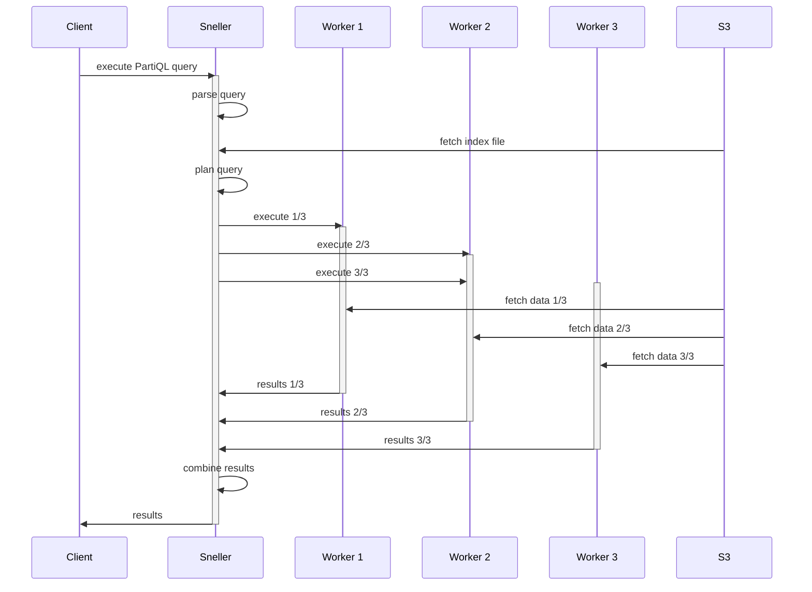

# Run Sneller on Kubernetes
Sneller is optimized to run on multiple nodes. Sneller in Docker works great for development, but it is too limited for production grade enviroments. Switching to Kubernetes provides the following benefits:

 * Horizontal scaling by adding more Sneller pods to the cluster.
 * Allows running with either AWS S3, Minio or another S3 compatible provider.

## Requirements

### AVX-512 support
Sneller heavily depends on AVX-512 to achieve its high perfomance. Pods that run the actual Sneller daemon should have a CPU that [supports AVX-512](https://en.wikipedia.org/wiki/AVX-512#CPUs_with_AVX-512). If not all nodes in the Kubernetes cluster support AVX-512, then you can use [`nodeSelector`](https://kubernetes.io/docs/concepts/scheduling-eviction/assign-pod-node/) to make sure the Sneller daemon pods are assigned to the proper nodes.

### Memory requirements
Sneller uses RAM memory to cache S3 data, so make sure your nodes are equipped with a lot of RAM. Like most databases, the engine is fast when the cache is filled with the data that needs to be queried. It's important to assign enough memory to the Sneller daemon pods to ensure good performance.

Sneller caches data loaded from object storage (S3) in the pod in `/var/cache/sneller` that is mounted as an [`emptydir` volume](https://kubernetes.io/docs/concepts/storage/volumes/#emptydir) that is backed by memory. For most optimal performance, the pods should be assigned enough memory to retain the data in cache. Note that specifying the size-limit is only available when the `SizeMemoryBackedVolumes` feature gate is enabled (optional for K8s v1.20/v1.21 and default enabled from v1.22+). If not specified, then the pod will use only 50% of the node's RAM for caching.

## Architecture
The Sneller architecture consists of 3 functional components:

  1. The **Sneller daemon** acts as the HTTP endpoint. It parses and plans the request and partitions the request into multiple chunks.
  2. The **Sneller worker** runs the query-plan for the partitioned query-plan.
  3. The **S3** object storage (or compatible) that holds all persistent data.

The Sneller daemon and worker share the same pod for efficiency. Each Sneller pod will always run a daemon and a worker (after the first query).

The cluster nodes don't store any persistent data, which is a major benefit. When query processing isn't required, then the entire cluster can be deleted without losing data. When the cluster needs to run again, then it can be recreated and used. This can significantly lower costs for situations where data is ingested at a consistent rate, but only queried rarely.

A typical query would look something like this:

## Helm package

Sneller is deployed using a Helm chart and installs the several resources. All resource names can be customized, but the default setting uses the distribution's name as a prefix:

 * The configmap `my-sneller-s3` that holds the *bucket* and *end-point* of the S3 service (can point to AWS S3, Minio, Wasabi, ...).
 * The secret `my-sneller-s3` that holds the *access key ID* and *secret access key* to access S3.
 * The secret `my-sneller-token` that holds the *token* that should be used to authorize to Sneller.
 * The secret `my-sneller-index` that holds the 32-byte key to sign the index file (base-64 encoded).
 * The deployment `my-sneller-snellerd` that provides the deployment and pod template for the nodes that run the actual Sneller engine. All configuration is established via the configmap and secrets.
 * The service `my-sneller-snellerd` that exposes the Sneller service. This service should be used to send Sneller queries to. The service will take care of distributing the HTTP request to one of the available pods.
 * The (headless) service `my-sneller-snellerd-headless` that exposes all the worker services. This service is used internally by the Sneller service to discover all the available worker pods and shouldn't be exposed externally.
 * The ingress `my-sneller-snellerd` exposes the Sneller daemon externally (requires that an ingress controller is already deployed in the cluster).
 * The cronjob `my-sneller-sdb` synchronizes all new JSON files in the source bucket into the cache bucket.

The Helm package can be deployed as-is, but typically you would want to change some parameters that can be customized.

### Common
Kubernetes resources all have a name and the Helm template typically uses a common naming scheme, so all resources can be easily related to the package installation. By default all resources have the prefix `<release>-<chart>`.

|Name|Description|Default|
|----|-----------|-------|
|nameOverride|String to partially override the `<chart>` in the naming prefix.|"" (uses `sneller`)|
|fullnameOverride|String to fully override the naming prefix.|"" (uses `<release>-<chart>`)|

### Sneller
|Name|Description|Default|
|----|-----------|-------|
|snellerd.name|Name of the Sneller daemon deployment and pods|""|
|snellerd.replicaCount|Number of replicas that run the Sneller daemon/worker|3|
|snellerd.repository|Repository that holds the Sneller container image|snellerinc/snellerd|
|snellerd.tag|Tag of the Sneller container image|latest|
|snellerd.pullPolicy|Sneller image pull policy|IfNotPresent|
|snellerd.ports.snellerd|Port of the Sneller daemon|8000|
|snellerd.ports.internode|Port of the Sneller worker (not to be exposed)|8001|
|snellerd.maxCacheDirSize|Maximum size of the caching directory (only respected when `SizeMemoryBackedVolumes` feature gate is enabled)|1Gi|
|snellerd.podLabels|Labels to add to all Sneller pods|{}|
|snellerd.podAnnotations|Annotations to add to all Sneller pods|{}|
|snellerd.nodeSelector|[Node selector](https://kubernetes.io/docs/concepts/scheduling-eviction/assign-pod-node/#nodeselector) to select the nodes that should run Sneller (useful to select AVX-512 capable nodes)|{}|
|snellerd.tolerations|Tolerations of the Sneller pods|[]|
|snellerd.affinity||{}|
|snellerd.serviceLabels|Labels to add to the Sneller service|{}|
|snellerd.serviceAnnotations|Annotations to add to the Sneller service|{}|
|snellerd.headlessServiceLabels|Labels to add to the headless Sneller service|{}|
|snellerd.headlessServiceAnnotations|Annotations to add to the headless Sneller service|{}|
|snellerd.resources|Resource units for the Sneller pods|{}|

### SDB
|Name|Description|Default|
|----|-----------|-------|
|sdb.name|Name of the SDB cronjob and pods|""|
|sdb.repository|Repository that holds the SDB container image|snellerinc/sdb|
|sdb.tag|Tag of the SDB container image|latest|
|sdb.pullPolicy|SDB image pull policy|IfNotPresent|

### Ingress
The Helm template can create a default Ingress resource, but it's fairly limited. If you need more sophisticated ingress, then disable the ingress creation and define your own Ingress resource that will map to the port `snellerd.ports.snellerd` of the Sneller service. The ingress definition does support TLS to enable secure HTTPS connectivity.

|Name|Description|Default|
|----|-----------|-------|
|ingress.enabled|Enable creation of the Ingress resource|false|
|ingress.ingressClassName|Ingress class name (if omitted, then a default ingress class should be defined)|""|
|ingress.hosts|List of hostnames that will be |[]|
|ingress.tls|List of TLS certificate definitions (see section below)|[]|
|ingress.annotations|Annotations to add to the ingress|{}|

#### Ingress TLS
|Name|Description|Default|
|----|-----------|-------|
|ingress.tls.*.hosts|Hostnames for this TLS certificate|""|
|ingress.tls.*.secretName|Name of the secret that holds the TLS certificate|""|

### S3 secrets
Sneller requires S3 (or compatible) object storage and is compatible with AWS S3, Minio (self-hosted) and other S3-compatible services. Access to AWS S3 is controlled using an *access key identifier* and a *secret access key* that are stored in a secret. The endpoint and bucket-name are set in the configuration.

|Name|Description|Default|
|----|-----------|-------|
|secrets.s3.useExistingSecret|Set to `true` to prevent creation of a new secret|false|
|secrets.s3.secretName|Name of the secret that holds the S3 credentials|""|
|secrets.s3.values.awsAccessKeyId|Access key identifier (required)|""|
|secrets.s3.values.awsSecretAccessKey|Secret access key (required)|""|

### Sneller token secret
Access to Sneller is controlled via a token.

|Name|Description|Default|
|----|-----------|-------|
|secrets.s3.useExistingSecret|Set to `true` to prevent creation of a new secret|false|
|secrets.s3.secretName|Name of the secret that holds the Sneller token|""|
|secrets.s3.values.snellerToken|Token to access the Sneller engine (required)|""|

### Sneller index secret
Sneller uses an index-file that is signed with the index-key to avoid tampering. The index-key should be a 32-byte base-64 encoded string.

|Name|Description|Default|
|----|-----------|-------|
|secrets.index.useExistingSecret|Set to `true` to prevent creation of a new secret|false|
|secrets.index.secretName|Name of the secret that holds the Sneller index key|""|
|secrets.index.values.snellerIndexKey|Index key that is used to sign the index-file (required)||

### Configuration
|Name|Description|Default|
|----|-----------|-------|
|configuration.name|Name of the configuration map that holds the Sneller configuration|""|
|configuration.values.s3EndPoint|Set to `true` to prevent creation of a new secret|http://minio:9000|
|configuration.values.s3Bucket|Set to `true` to prevent creation of a new secret|s3://test/|

# Automatic deployment
Although a Kubernetes deployment should be carefully planned and configured, we do provide a `run.sh` script. This script creates the required IAM roles (make sure you have the proper credentials to do so).

# Optimizing performance

### Scaling the cluster and caching
Sneller uses a cache partitioning scheme based on [rendez-vous hashing](https://en.wikipedia.org/wiki/Rendezvous_hashing) that is fast and effective. The only drawback is that the partioning may change when adding/removing nodes, so this may (partially) invalidate a part of the cache. This may cause queries to run more slowly, until the cache has been restored.

### Keep your data close
Sneller uses S3 object storage for all persistent storage. Data that is not available in RAM needs to be loaded from S3. To improve performance and reduce costs, it's best to run Sneller in the same region as where your data is stored. Consider using Minio when you're not running in AWS and host Minio in the same Kubernetes cluster.

Sneller currently doesn't have support for Azure blob storage or Google Storage, but the architecture has been designed so it could be added later.
